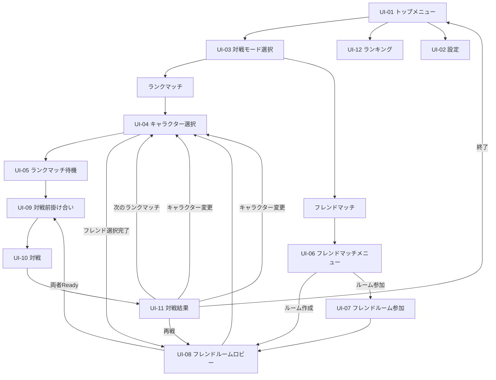

# AHOGE LEGEND 画面設計

## 1. 文書情報

- 対象プロダクト: `AHOGE LEGEND`
- 上位設計: `docs/BASIC_DESIGN.md`
- 関連詳細設計: `docs/DETAILED_DESIGN.md`
- 文書目的: 主要画面、画面遷移、UI要素、ワイヤーフレーム、Godot Scene分割方針を定義する
- ステータス: 初版
- 作成日: 2026-09-27

本書は最終アートを決めるものではなく、実装開始前の情報設計とラフレイアウトを正本化する。

配色、フォント、ロゴ、背景イラスト、正式キャラクター素材、演出の最終品質は別作業で決定する。

## 2. 画面設計の基本方針

### 2.0 初期実装の優先順位

初期実装では、画面レイアウト、装飾デザイン、配色、フォント、細かなUIアニメーションや演出の完成度よりも、各画面が必要な機能と画面遷移を満たすことを優先する。

初期段階では仮レイアウト、仮フォント、仮色、簡易コンポーネントを使用してよい。

ただし、次は初期実装でも満たす。

- 必要な画面へ遷移できる
- 戻る／決定等の操作が機能する
- ランクマッチとフレンドマッチの機能差が正しい
- キャラクター選択結果が対戦へ引き継がれる
- 対戦HUDに必要な状態が表示される
- 対戦結果から次の正しい画面へ進める
- ランキング画面でPLAYER / AHOGE LEGENDを分離できる
- エラーや待機状態が無反応にならない

レイアウト、フォント、配色、余白、装飾、細かなUI挙動は、機能が通った後のUI改善作業で段階的に調整する。


### 2.1 アホ毛を主役にする

キャラクター全身ではなく、頭頂部とアホ毛を主役として見せる。

特にキャラクター選択、対戦画面、AHOGE LEGENDランキングでは、アホ毛の形状・動き・順位が視線の中心になる構成とする。

### 2.2 対戦開始までの操作を短くする

ランクマッチは次の最短導線を基本とする。

```text
TOP
→ ONLINE BATTLE
→ RANKED MATCH
→ CHARACTER SELECT
→ MATCHING
→ BATTLE
```

画面を増やす場合でも、不要な確認画面を挟まない。

### 2.3 ランクマッチとフレンドマッチの差を明確にする

ランクマッチ:

- Ratingが変動する
- PLAYERランキングへ反映される
- AHOGE LEGENDランキングへ反映される
- 直接の再戦機能を持たない

フレンドマッチ:

- Rating変動なし
- ランキング集計対象外
- ルームコードを使用する
- 対戦後に再戦可能

### 2.4 対戦中の視認性を最優先する

対戦中はキャラクター情報よりも、以下を優先して視認できるようにする。

1. 相手の頭部・アホ毛
2. 攻撃予備動作
3. チャージ状態
4. パリィ／回避
5. 85秒タイマー
6. ヒット数
7. ラウンド取得数

装飾UIがアホ毛の可動範囲を隠さないようにする。

### 2.5 画面比率

PCゲームとして全体UIはワイド画面へ対応する。

対戦の主要戦闘領域は、HTMLプロトタイプで感触の良かった約5:4の近正方形領域を中央へ配置する案を初期基準とする。

ワイド画面の余白は、プレイヤー情報、ラウンド情報、装飾等へ利用できる。

5:4の最終採用はHuman Verificationで決定する。

## 3. 画面一覧

| ID | 画面 | 種別 | 主目的 |
| --- | --- | --- | --- |
| UI-01 | トップメニュー | メイン画面 | ゲーム機能の入口 |
| UI-02 | 設定 | サブ画面 | 音量・画面等の設定 |
| UI-03 | 対戦モード選択 | メイン画面 | ランク／フレンド選択 |
| UI-04 | キャラクター選択 | メイン画面 | 使用キャラクター決定 |
| UI-05 | ランクマッチ待機 | メイン画面 | ランダムマッチング |
| UI-06 | フレンドマッチメニュー | メイン画面 | ルーム作成／参加 |
| UI-07 | フレンドルーム参加 | サブ画面 | ルームコード入力 |
| UI-08 | フレンドルームロビー | メイン画面 | 入室・キャラ・Ready管理 |
| UI-09 | 対戦前掛け合い | 遷移演出 | 短いテキスト掛け合い |
| UI-10 | 対戦 | コア画面 | 1対1対戦 |
| UI-11 | 対戦結果 | メイン画面 | 勝敗・次アクション |
| UI-12 | ランキング | メイン画面 | PLAYER / AHOGE LEGEND閲覧 |

クレジット等の補助画面は後続作業で追加可能とし、初期実装の主要画面には含めない。

## 4. 画面遷移

### 4.1 全体遷移



### 4.2 ランクマッチ導線

```text
トップメニュー
↓
対戦モード選択
↓
ランクマッチ
↓
キャラクター選択
↓
マッチング待機
↓
対戦相手決定
↓
対戦前掛け合い
↓
対戦
↓
結果
├─ 次のランクマッチ → キャラクター選択
├─ キャラクター変更 → キャラクター選択
└─ 終了 → トップメニュー
```

同一相手を指定して再戦する導線は持たない。

### 4.3 フレンドマッチ導線

```text
トップメニュー
↓
対戦モード選択
↓
フレンドマッチ
↓
├─ ルーム作成
│   ↓
│   ルームロビー
│
└─ ルーム参加
    ↓
    コード入力
    ↓
    ルームロビー

ルームロビー
↓
キャラクター選択
↓
ルームロビーへ戻る
↓
両者Ready
↓
対戦前掛け合い
↓
対戦
↓
結果
├─ 再戦 → ルームロビー
├─ キャラクター変更 → キャラクター選択
└─ 終了 → トップメニュー
```

## 5. 共通UI

### 5.1 戻る操作

対戦中以外の画面では原則として「戻る」を提供する。

戻る操作は画面左下またはUI上の同一位置へ寄せ、画面ごとに場所を大きく変えない。

### 5.2 決定操作

主要な決定操作は右下または画面中央下へ配置する。

例:

- 決定
- マッチング開始
- 参加
- Ready

### 5.3 エラー表示

通信失敗、無効なルームコード、マッチング失敗等は画面遷移させず、同一画面上のメッセージまたはモーダルで表示する。

### 5.4 ローディング

Nakama通信やScene切替で待ち時間が発生する場合、入力不能な無反応状態を作らず、最低限ローディング状態を表示する。

## 6. UI-01 トップメニュー

### 6.1 目的

ゲーム起動後の主要入口とする。

### 6.2 主要UI

- AHOGE LEGENDロゴ
- ONLINE BATTLE
- RANKING
- SETTINGS
- EXIT
- バージョン表記
- 必要に応じてログイン中プレイヤー名

### 6.3 ワイヤーフレーム

```text
┌──────────────────────────────────────────────────────────────┐
│                                                      Player  │
│                                                              │
│                     A H O G E  L E G E N D                   │
│                        [ GAME LOGO ]                          │
│                                                              │
│                       ONLINE BATTLE                          │
│                         RANKING                              │
│                         SETTINGS                             │
│                           EXIT                               │
│                                                              │
│                                                      v0.x.x  │
└──────────────────────────────────────────────────────────────┘
```

### 6.4 遷移

- ONLINE BATTLE → UI-03
- RANKING → UI-12
- SETTINGS → UI-02
- EXIT → ゲーム終了確認

## 7. UI-02 設定画面

### 7.1 目的

ゲームの基本設定を変更する。

### 7.2 初期項目

#### AUDIO

- Master Volume
- BGM Volume
- SE Volume
- Voice Volume

#### DISPLAY

- Window / Fullscreen
- Resolution
- VSync

#### CONTROL

- 左クリック: Attack / Charge
- 右クリック: Parry / Dodge

初期段階ではキーコンフィグを必須としない。将来追加できる構造にする。

### 7.3 ワイヤーフレーム

```text
┌──────────────────────────────────────────────────────────────┐
│ SETTINGS                                                     │
│                                                              │
│  AUDIO                 DISPLAY                CONTROL        │
│  Master   [=====---]    Mode [Fullscreen▼]    L Click Attack │
│  BGM      [====----]    Resolution [1920x1080] R Click Guard │
│  SE       [======--]    VSync [ON]                           │
│  Voice    [=====---]                                          │
│                                                              │
│  [DEFAULT]                                      [APPLY]      │
│  [BACK]                                                       │
└──────────────────────────────────────────────────────────────┘
```

## 8. UI-03 対戦モード選択

### 8.1 目的

ランクマッチとフレンドマッチを明確に分ける。

### 8.2 ワイヤーフレーム

```text
┌──────────────────────────────────────────────────────────────┐
│ ONLINE BATTLE                                                │
│                                                              │
│     ┌───────────────────┐      ┌───────────────────┐         │
│     │   RANKED MATCH    │      │   FRIEND MATCH    │         │
│     │                   │      │                   │         │
│     │ Rating battle     │      │ Room code battle  │         │
│     │ Monthly ranking   │      │ No rating change  │         │
│     └───────────────────┘      └───────────────────┘         │
│                                                              │
│ [BACK]                                                       │
└──────────────────────────────────────────────────────────────┘
```

### 8.3 表示上の差

ランクマッチ側には、現在のRatingとランク帯を表示してよい。

フレンドマッチ側には「ランキング対象外」を明示する。

## 9. UI-04 キャラクター選択

### 9.1 目的

使用するキャラクター／アホ毛を選択する。

### 9.2 必須情報

- キャラクター一覧
- 選択中キャラクターの頭頂部＋アホ毛プレビュー
- キャラクター名
- アホ毛タイプ
- 攻撃タイプ
- 簡潔な特徴説明
- 決定
- 戻る

### 9.3 推奨情報

オンラインランキング実装後は、選択中キャラクターについて当月のAHOGE LEGEND順位と総勝利数を表示してよい。

例:

```text
AHOGE LEGEND #3
18,432 WINS
```

これはキャラクター性能値ではなく、当月の全プレイヤー合算勝利数であることが分かる表示にする。

### 9.4 ワイヤーフレーム

```text
┌──────────────────────────────────────────────────────────────┐
│ CHARACTER SELECT                                             │
│                                                              │
│ ┌─────────────┐     ┌───────────────────┐  ┌──────────────┐ │
│ │ Character A │     │                   │  │ NAME         │ │
│ │ Character B │     │   HEAD + AHOGE    │  │ Ahoge: LONG  │ │
│ │ Character C │     │     PREVIEW       │  │ Attack: SWING│ │
│ │ Character D │     │                   │  │              │ │
│ │ ...         │     │                   │  │ Rank #3      │ │
│ └─────────────┘     └───────────────────┘  │ 18,432 wins  │ │
│                                            └──────────────┘ │
│ [BACK]                                           [DECIDE]    │
└──────────────────────────────────────────────────────────────┘
```

### 9.5 モーションプレビュー

最終実装では、選択キャラクターのアホ毛が待機モーションする構成を推奨する。

攻撃プレビューは初期実装の必須条件ではない。

## 10. UI-05 ランクマッチ待機

### 10.1 目的

ランダムマッチング中であることを明確にする。

### 10.2 表示

- MATCHING...
- 選択キャラクター
- 現在Rating
- 経過時間
- 検索状態
- CANCEL

対戦相手の情報はマッチ確定前に表示しない。

### 10.3 ワイヤーフレーム

```text
┌──────────────────────────────────────────────────────────────┐
│ RANKED MATCH                                                 │
│                                                              │
│                    MATCHING...                               │
│                                                              │
│                  [ SELECTED AHOGE ]                          │
│                                                              │
│                    Rating 1532                               │
│                      00:18                                   │
│                                                              │
│                     [CANCEL]                                 │
└──────────────────────────────────────────────────────────────┘
```

## 11. UI-06 フレンドマッチメニュー

### 11.1 目的

ルーム作成とルーム参加を選択する。

### 11.2 ワイヤーフレーム

```text
┌──────────────────────────────────────────────────────────────┐
│ FRIEND MATCH                                                 │
│                                                              │
│              ┌─────────────────────┐                         │
│              │     CREATE ROOM     │                         │
│              └─────────────────────┘                         │
│                                                              │
│              ┌─────────────────────┐                         │
│              │      JOIN ROOM      │                         │
│              └─────────────────────┘                         │
│                                                              │
│ [BACK]                                                       │
└──────────────────────────────────────────────────────────────┘
```

## 12. UI-07 フレンドルーム参加

### 12.1 目的

6文字のルームコードを入力して参加する。

### 12.2 ワイヤーフレーム

```text
┌──────────────────────────────────────────────────────────────┐
│ JOIN FRIEND ROOM                                             │
│                                                              │
│                       ROOM CODE                              │
│                    ┌──────────────┐                          │
│                    │   A7K9PQ     │                          │
│                    └──────────────┘                          │
│                                                              │
│                       [JOIN]                                 │
│                                                              │
│ Error message area                                           │
│ [BACK]                                                       │
└──────────────────────────────────────────────────────────────┘
```

無効コード、期限切れ、満員等の理由を識別して表示できる構造とする。

## 13. UI-08 フレンドルームロビー

### 13.1 目的

2人が接続し、キャラクター選択とReady状態を確認する。

### 13.2 必須UI

- 6文字ルームコード
- Copy
- ホスト
- ゲスト
- 接続状態
- 選択キャラクター
- CHARACTER SELECT
- READY
- LEAVE ROOM

### 13.3 ワイヤーフレーム

```text
┌──────────────────────────────────────────────────────────────┐
│ FRIEND ROOM                         CODE: A7K9PQ [COPY]       │
│                                                              │
│ ┌──────────────────────┐      ┌──────────────────────┐      │
│ │ HOST                 │      │ GUEST                │      │
│ │ Player A             │      │ Player B             │      │
│ │ [Selected Ahoge]     │      │ [Selected Ahoge]     │      │
│ │ READY                │      │ NOT READY            │      │
│ └──────────────────────┘      └──────────────────────┘      │
│                                                              │
│ [CHARACTER SELECT]                             [READY]       │
│ [LEAVE ROOM]                                                 │
└──────────────────────────────────────────────────────────────┘
```

両者がReadyになった場合のみ対戦開始へ進む。

## 14. UI-09 対戦前掛け合い

### 14.1 目的

キャラクター同士の短い掛け合いで対戦開始を演出する。

### 14.2 方針

独立した大規模Sceneではなく、対戦Scene開始前のOverlayとして実装可能な構造にする。

- 左キャラクター表示
- 右キャラクター表示
- テキスト
- 数行以内
- ボイスなし
- 終了後にBattle開始

### 14.3 ワイヤーフレーム

```text
┌──────────────────────────────────────────────────────────────┐
│                                                              │
│  [LEFT HEAD]                                  [RIGHT HEAD]   │
│                                                              │
│      ┌──────────────────────────────────────────────┐        │
│      │ 「対戦前の短い掛け合いテキスト」             │        │
│      └──────────────────────────────────────────────┘        │
│                                                              │
│                         READY...                             │
└──────────────────────────────────────────────────────────────┘
```

## 15. UI-10 対戦画面

### 15.1 目的

ゲームの中心画面。

### 15.2 表示優先順位

最優先:

- 頭部
- アホ毛
- 攻撃モーション
- 防御モーション

HUD:

- Player名
- キャラクター名
- 取得ラウンド数
- ヒット数
- 85秒タイマー
- OVERTIME
- JUST PARRY
- JUST DODGE
- CLASH
- Stagger等の短いフィードバック

### 15.3 ワイヤーフレーム

```text
┌────────────────────────────────────────────────────────────────────┐
│ Player A   ●○   HIT 2        85        HIT 3   ○○   Player B       │
│ Char A                                                     Char B  │
│                                                                    │
│       ┌──────────────── BATTLE AREA 約5:4 ────────────────┐       │
│       │                                                    │       │
│       │  LEFT HEAD + AHOGE        RIGHT AHOGE + HEAD      │       │
│       │          \                        /                │       │
│       │           \       CLASH!         /                 │       │
│       │            \                    /                  │       │
│       │                                                    │       │
│       └────────────────────────────────────────────────────┘       │
│                                                                    │
│               JUST PARRY / JUST DODGE / OVERTIME                  │
└────────────────────────────────────────────────────────────────────┘
```

### 15.4 ヒット数表示

5ヒット制の初期値では、数値表示または5段階マーカーを使用できる。

表示方式の最終デザインは未決だが、現在ヒット数を即座に認識できることを必須とする。

### 15.5 ラウンド表示

BO3のため、各プレイヤーについて最大2つの取得マーカーを表示すればよい。

### 15.6 タイマー

画面中央上部へ大きく表示する。

```text
85 → 84 → ... → 0
```

分秒表記へ変更しない。

### 15.7 OVERTIME

同点で85秒が終了した場合、通常タイマー位置を使って `OVERTIME` を強調表示する。

次の有効ヒットでラウンド終了することが分かる補助表示を追加してよい。

### 15.8 オンライン対戦中のPause

オンライン対戦ではゲーム進行そのものを一時停止しない。

必要な離脱操作はPauseではなく、対戦を継続したまま表示する確認Overlayとして別途設計する。


### 15.9 M1 Battle Coreデバッグ表示

M1 #53ではUI-10の本番導線完成を待たず、起動引数 `--m1-battle` でBattleへ直接入れる。

M1では同一Godot実ウィンドウ内で2つのauthoritative clientを成立させ、P1をマウス、P2をQ/Eで操作する。画面は通常の `BattleHUD` と `FighterVisual` を再利用し、ローカル戦闘ロジックではなくNakamaから受信したauthoritative eventで更新する。

初期M1レイアウトでは1280×720内の中央に約5:4の戦闘領域候補を置き、左右余白を残す。5:4はM1でHuman Verificationする候補値であり、M1 PASSだけで最終採用とはしない。

M1で最低限表示するもの:

- P1 / P2キャラクター名
- Round取得数
- Hit数
- 85秒timer
- Round番号
- OVERTIME
- PARRY / DODGE / JUST PARRY / JUST DODGE
- CLASH
- STAGGER
- SHORT detach / regrow
- Round winner
- Match winner / final score
- 接続中・接続失敗・操作可能状態

M1専用表示やデバッグ操作は、工程4の正式UI導線・最終キー設定・最終レイアウトを確定するものではない。

Reconnect #69のHuman Verification用に、M1 direct modeでは `F8` を「P1 Realtime Socketの予期しない切断を模擬する」デバッグ操作として使用する。

- F8はM1 / Human Verification専用であり、本番キー仕様には含めない
- F8では通常の退出APIを使わずSocketを閉じ、clientの自動Reconnect経路を実際に通す
- 切断後は `RECONNECTING...` → snapshot同期 → Battle復帰を目視確認する


### 15.10 Round取得・次Round開始表示

M1でRoundを1本取得した場合、次Roundへ無表示で切り替えない。

Round終了時は中央フィードバック領域に少なくとも次を表示する。

```text
P1 TAKES ROUND 1
SCORE 1 - 0
```

表示はauthoritative `BO3_SCORE_CHANGED` を正本とし、clientで勝数を推測しない。

Round取得表示は次Round Countdownと同時に出さない。M1では暫定2秒、中央フィードバック領域へ単独表示する。

表示例:

```text
P1 TAKES ROUND 1
SCORE 1 - 0
```

この2秒間は次Roundの `3 / 2 / 1 / GO!` を表示しない。表示終了後にCountdownへ遷移する。

Match終了でない場合、その後の次Round準備では中央に次を大きく重ねる。

```text
ROUND 2
3
↓
2
↓
1
↓
GO!
```

要件:

- Countdown中も上部timer表示は次Round初期値 `85` を表示する
- Countdown中はHit数を `0 / 5` へresetした状態で表示する
- Countdown中はP1/P2 stateを `ROUND_LOCKED` として表示する
- `GO!` で戦闘開始が視覚的に明確であること
- `GO!` 後は前Roundのwinner messageを残し続けない
- Round取得数は次Round中もHUD上部へ継続表示する
- 5:4 Battle領域とアホ毛をCountdown文字が恒常的に隠さないこと

Countdownの `3 / 2 / 1 / GO!` はserver eventに同期する。演出上のfade/scale等はclient側で追加できるが、開始時刻をclient単独で決めない。

## 16. UI-11 対戦結果

### 16.1 共通表示

- WIN / LOSE
- マッチ勝者
- 勝利キャラクター
- 勝利時の短いテキスト
- 各ラウンド結果

### 16.2 ランクマッチ結果

追加表示:

- Rating変動
- 新Rating
- ランク帯
- 勝者の場合、使用アホ毛の当月総勝利数への `+1` 演出
- 現在のAHOGE LEGEND順位を表示してよい

再戦ボタンは表示しない。

### 16.3 ランクマッチワイヤーフレーム

```text
┌──────────────────────────────────────────────────────────────┐
│                         YOU WIN                              │
│                                                              │
│                    [ WINNER AHOGE ]                          │
│                                                              │
│ Rating       1532 → 1548   (+16)                            │
│ AHOGE WINS   18,432 → 18,433   (+1)                         │
│ AHOGE RANK   #3                                              │
│                                                              │
│ [NEXT MATCH]   [CHANGE CHARACTER]   [EXIT]                  │
└──────────────────────────────────────────────────────────────┘
```

### 16.4 フレンドマッチ結果

ランキング関連数値は更新しない。

```text
[REMATCH] [CHANGE CHARACTER] [EXIT]
```

## 17. UI-12 ランキング

### 17.1 目的

プレイヤー個人の強さと、全プレイヤーで競う伝説のアホ毛を別々に表示する。

### 17.2 タブ

```text
[ PLAYER ] [ AHOGE LEGEND ]
```

### 17.3 PLAYER

PLAYERタブはRating降順で表示する。同Ratingは同順位とし、wins / lossesは順位決定には使用しない。

表示候補:

- 順位
- プレイヤー名
- Rating
- ランク帯
- 勝数
- 敗数

### 17.4 AHOGE LEGEND

当月総マッチ勝利数の降順で表示する。同勝利数は同順位とし、使用回数・勝率はtie-breakに使用しない。

表示必須:

- 順位
- キャラクター／アホ毛
- 当月総マッチ勝利数
- 対象シーズン
- 1位の強調表示

1位は「LEGENDARY AHOGE」等の特別表示を使用できる。

順位決定に勝率や使用率は使用しない。

### 17.5 ワイヤーフレーム

```text
┌──────────────────────────────────────────────────────────────┐
│ RANKING                         2026 / 09                    │
│                                                              │
│              [ PLAYER ] [ AHOGE LEGEND ]                    │
│                                                              │
│  👑 1   Character A                 128,421 WINS             │
│     2   Character B                 116,882 WINS             │
│     3   Character C                  98,114 WINS             │
│     4   Character D                  91,306 WINS             │
│                                                              │
│              Reset: Next month 1st 00:00 JST                │
│                                                              │
│ [BACK]                                                       │
└──────────────────────────────────────────────────────────────┘
```

過去月ランキングはデータとして保持するが、過去月閲覧UIは初期実装の必須対象としない。

## 18. 状態Overlay

独立画面にせず、必要に応じて各画面上へ重ねる。

### 18.1 通信エラー

- 接続失敗
- サーバー応答なし
- 再試行
- トップメニューへ戻る

### 18.2 再接続中

自分の接続が切れた場合:

```text
RECONNECTING...
15
14
13
...
```

15秒以内に復帰した場合は、server authoritative snapshotを受信して現在の対戦状態へ同期する。

相手だけが切断した場合:

- Round進行中はBattleを継続する。相手側は新規操作を行えない
- Round開始前またはRound終了後は `WAITING FOR OPPONENT...` を表示し、次Roundへの進行を待つ
- Countdown中に相手が切断した場合はCountdown表示を停止する
- 相手が復帰したらserver stateに同期して待機表示を解除する

再接続待機Overlayは最終デザインではなく、工程4の全画面UI見直し対象とする。

再ログイン時の復帰表示:

- 保存済みmatchが進行中: `RECONNECTING...` を表示し、snapshot受信後にBattleへ直接復帰
- 保存済みRanked matchが終了済み: Battleを表示せずUI-11へ直接遷移
- 保存済みFriend matchが終了済み: UI-11を再表示せず、Friend文脈のCharacter Select（選択メニュー）へ遷移
- 未解決matchがある間は新しいRanked / Friend開始操作を無効化し、元matchの復帰または終了処理を優先する
- 15秒を超えても回線が未復旧の場合、clientは元matchを破棄せず接続復旧を待つ。復旧後に終了済み結果を取得する
- serverが元matchに対して確定的に `NOT_FOUND` を返した場合のみ「元の対戦は復旧できませんでした」と通信エラー表示し、古い対戦lockを解除する
- 通信エラー画面には「対戦状態を再確認」操作を用意できる。この操作はserver確認を行い、元matchが存在しないと確定した場合だけlockを解除する
- 「lockを強制解除して新しい対戦を開始」のような無条件解除操作は提供しない


### 18.3 退出確認

オンライン対戦中に退出しようとした場合は、対戦を停止せず確認Overlayを表示する。

## 19. Godot Scene分割方針

### 19.1 画面Scene

初期構成候補:

```text
scenes/
  app/
    AppRoot.tscn

  screens/
    top_menu/
      TopMenu.tscn
    settings/
      Settings.tscn
    battle_mode/
      BattleModeSelect.tscn
    character_select/
      CharacterSelect.tscn
    ranked_matching/
      RankedMatching.tscn
    friend_match/
      FriendMatchMenu.tscn
      FriendRoomJoin.tscn
      FriendRoomLobby.tscn
    battle/
      Battle.tscn
      BattleHUD.tscn
    result/
      MatchResult.tscn
    ranking/
      Ranking.tscn

  overlays/
    PreBattleDialogue.tscn
    LoadingOverlay.tscn
    ErrorDialog.tscn
    ReconnectingOverlay.tscn
    LeaveMatchDialog.tscn
```

実際のディレクトリ名はIssue #3実装時に調整可能だが、画面責務を1つの巨大Sceneへ集約しない。

### 19.2 AppRoot

`AppRoot` は以下を担当する。

- 画面遷移
- 共通サービス参照
- ローディングOverlay
- グローバル設定
- ログイン状態

戦闘ルールを持たせない。

### 19.3 Battle

`Battle.tscn` はゲームプレイ領域を担当し、`BattleHUD.tscn` をCanvasLayer等で分離する。

HUD変更が戦闘ロジックへ影響しない構造にする。

### 19.4 再利用コンポーネント

後続実装では以下を再利用可能なUI部品候補とする。

- CharacterCard
- PlayerBadge
- RankBadge
- AhogeRankRow
- PrimaryButton
- SecondaryButton
- VolumeSlider
- ModalDialog
- SeasonLabel

## 20. Issue #3への接続

Issue #3では全画面を一度に実装しない。

最初の縦切りでは最低限次だけ実装する。

1. `AppRoot`
2. 仮の`TopMenu`
3. 仮の`CharacterSelect`
4. `Battle`
5. `BattleHUD`
6. 仮の`MatchResult`

オンライン専用画面、ランキング、フレンドルーム画面は、ローカル対戦基盤の後で順次実装する。

この順序により、画面構造を先に固定しつつ、ゲームコアの動作確認を最優先にする。

## 21. Human Verification

画面実装後は少なくとも以下を人間が確認する。

- トップメニューから対戦まで迷わず進めるか
- 戻る／決定操作の位置が一貫しているか
- キャラクター選択でアホ毛が主役に見えるか
- 対戦HUDがアホ毛の動きを邪魔しないか
- 85秒タイマーが瞬時に認識できるか
- ヒット数とラウンド取得数を混同しないか
- ランク／フレンドの違いが理解できるか
- AHOGE LEGENDランキングが「全プレイヤーの総勝利数」であることが伝わるか
- ランクマッチ結果で自分の勝利がアホ毛ランキングへ加算されたことが伝わるか

## 22. 未決事項

以下は本書では確定しない。

- 最終ロゴ
- 最終配色
- 最終フォント
- メニュー背景
- UIアニメーション
- 各ボタンの最終サイズ
- 画面全体の基準解像度
- 5:4戦闘領域の最終採用
- ランキング過去月閲覧UI
- 対戦前掛け合いのスキップ可否
- キー／ゲームパッド操作の最終仕様
